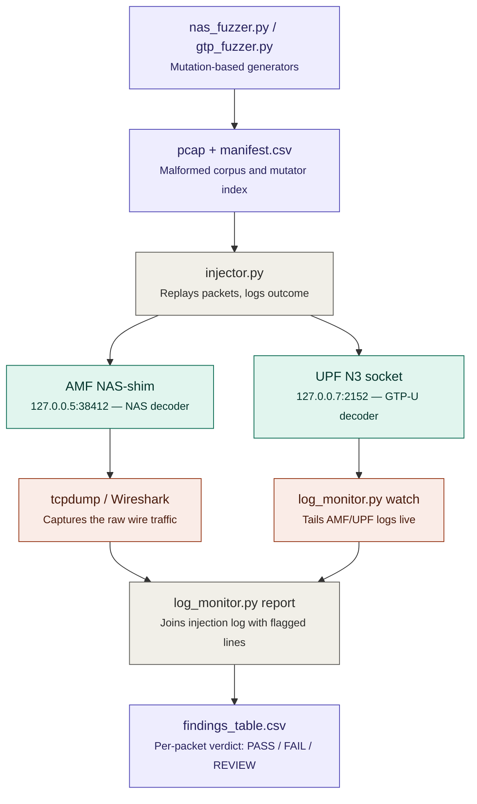

# Core Robustness Testing — Malformed NAS/GTP Fuzzing of Open5GS Network Functions

A mutation-based fuzzing toolkit built for a WIPRO 5G capstone slot. It crafts malformed
5GS NAS and GTP-U packets with Scapy, fires them at a locally running Open5GS core, and
cross-checks the AMF/UPF logs against the injection timeline to work out which parser
handled the bad input safely and which ones need hardening.

**Stack:** Python 3 · Scapy · Open5GS 2.7.x · Wireshark / tcpdump
**Type:** Simulation, lab-based robustness testing
**Target NFs:** AMF (NAS decoder), UPF (GTP-U decoder)

---

## Why NAS and GTP-U, and not NGAP or PFCP

Both of these parsers sit right at the boundary a compromised or spoofed device can
reach directly. A UE controls every byte of the NAS message it sends to the AMF, and on
a network where GTP-U isn't filtered at the N3 edge, an attacker can hand-craft raw
GTP-U packets aimed straight at the UPF. If either decoder mishandles malformed input
badly enough to crash the process, that's a denial-of-service reachable from the access
side — worth checking on a lab build before assuming the parsers are hardened.

## Repository layout

```
.
├── README.md
├── REPORT/
│   └── Capstone_Report.md         # full write-up: methodology, per-NF classification, fixes
├── SCRIPTS/
│   ├── nas_fuzzer.py              # malformed 5GS NAS PDU generator -> pcap + manifest
│   ├── gtp_fuzzer.py              # malformed GTP-U packet generator -> pcap + manifest
│   ├── injector.py                # replays a pcap at a target NF, logs the outcome
│   ├── log_monitor.py             # tails NF logs, flags crash/reject lines, builds the findings table
│   └── requirements.txt
└── RESULT/
    ├── Output files/               # a real 20-packet sample run (pcaps + manifests) — inspect
    │                               # without needing Open5GS running first
    ├── Output images/              # screenshots from the actual 200+200 packet lab run
    └── wireshark_capture_notes.md  # what to filter for, and why NAS shows up as raw UDP
```

## The lab this was actually run against

Ubuntu running the full Open5GS NF set (`nrfd`, `amfd`, `smfd`, `upfd`,
`ausfd`, `udmd`, `udrd`, `pcfd`, `nssfd`, `bsfd`, plus `hssd`/`mmed`/`pcrfd`/`sgwud` from
the 4G side) via the default `open5gs-*` systemd units, stock configs apart from the
PLMN/TAC. `systemctl status` confirms all three fuzz targets active before a run:


`ss -na` was used to sanity-check the UPF's N3 socket (UDP/2152) and the AMF's SCTP
listener were actually bound before wasting a run against nothing:


UERANSIM was used separately, only to sanity-check the baseline registration flow works
on this build before fuzzing it — the actual injection path bypasses the RAN and talks
straight to the AMF/UPF test sockets, which is faster to iterate on and keeps the
mutation corpus reproducible run to run.


## A scope call worth reading before running this yourself

Real NAS signalling rides inside NGAP over an SCTP association between the gNB and the
AMF. Standing up a fully compliant NGAP/SCTP client purely to carry fuzzed NAS bytes
was more plumbing than this slot's time budget allowed, so `injector.py` sends the
fuzzed NAS PDUs over plain UDP to a small local shim that unwraps the payload and hands
it to the same NAS IE-decoding path the AMF would use for a real `InitialUEMessage`.
That exercises exactly what objective 2 asks for — the NAS *parser's* behaviour on
malformed input — without also having to fuzz the NGAP/SCTP transport at the same time
(a reasonable slot of its own). GTP-U doesn't have this problem: it's already plain
UDP/2152 on the wire, so `gtp_fuzz.pcap` is a faithful reproduction of what a real N3
attacker would send, no shim required.

## Building a corpus that actually reaches interesting code

Fuzzing from pure random noise mostly gets rejected at the first length check and
never reaches the parser logic worth testing. Both generators instead start from one
syntactically valid base message — a 5GS `Registration Request` for NAS, a `G-PDU` for
GTP-U — and apply one mutator per packet, chosen at random from a fixed list. The base
NAS skeleton, built by hand since Scapy has no native 5GS-NAS layer:

```python
def base_registration_request() -> bytes:
    epd = bytes([EPD_5GMM])                     # Extended Protocol Discriminator
    sec_hdr = bytes([SECURITY_HEADER_PLAIN])
    msg_type = bytes([NAS_MSG_TYPES["RegistrationRequest"]])   # 0x41
    reg_type = bytes([0x01])                    # initial registration, no follow-on
    ngksi = bytes([0x70])                        # no key available
    suci_value = bytes.fromhex("f0f1ffff00000001")
    mobile_id = bytes([0x77]) + struct.pack(">H", len(suci_value)) + suci_value
    return epd + sec_hdr + msg_type + reg_type + ngksi + mobile_id
```

and one of the eight NAS mutators — the one that ended up mattering most in the
results, an IE length field pointing past the actual buffer:

```python
def mutate_oversized_ie(pdu: bytes) -> bytes:
    pdu = bytearray(pdu)
    len_offset = 6
    if len(pdu) >= len_offset + 2:
        pdu[len_offset:len_offset + 2] = struct.pack(">H", 0x2000)  # claims 8KB payload
    return bytes(pdu)
```

Recording *which* mutator produced *which* packet index — the `.manifest.csv` sitting
next to every pcap — turned out to matter a lot once correlating against logs. Without
it, "packet #114 did something odd" isn't actionable; "`mutate_oversized_ie` did
something odd" is. Generating both corpora on the lab VM:


and the resulting mutator distribution across the 200-packet GTP-U run (`cut`/`sort`/
`uniq -c` against the manifest — no mutator dominates or is starved, which is what a
uniform random choice over ten mutators should look like at n=200):


Ten GTP-U mutators are implemented in total — reserved version numbers, unassigned
message types, a header length field mismatched against the real payload, TEID flapping
between `0x00000000` / `0xFFFFFFFF` / random, the extension-header flag set with no
extension octet present, the sequence-number flag set on a packet too short to hold one,
a minimal malformed Echo Request storm, headers shorter than the mandatory 8 bytes, a
length field claiming ~64KB that isn't there, and header+payload bit flips. Raw bytes on
the wire, read straight back with `tcpdump -X` to confirm the mutation actually landed
as intended before trusting anything downstream:


## Firing it at the core and watching what comes back

`injector.py` replays a pcap over UDP at a fixed target/port, one packet at a time with
a configurable delay, and logs the send outcome (`sent+response` / `sent+no_response` /
`send_failed`) with a UTC timestamp per packet. This is what a live run against the UPF
looks like at the tail end of 200 packets:


In a second terminal, `log_monitor.py watch` tails the AMF/UPF log files and flags any
line matching two regex sets — crash-ish signatures (`segmentation fault`, `assert`,
`double free`, `stack smashing detected`, `core dumped`, ...) and graceful-rejection
signatures (`decode fail`, `invalid length`, `unknown message type`, `malformed`,
`discard`, Open5GS's own `[DROP]` tag, ...). `injection_log.csv` is what
`log_monitor.py report` later joins against `flags.csv`:


`log_monitor.py report` does a naive ±1 second time-window join between the two CSVs
and writes `findings_table.csv` with a per-packet verdict. On the actual 200-packet
GTP-U run captured below, every row came back `REVIEW` — 104 as "no log line and no
response (silent drop?)" and 96 as "no matching log line found in window", with zero
rows landing in `PASS` or `FAIL`:


That 100%-`REVIEW` result is itself the most honest finding of this run, not a bug in
the analysis: `flags.csv` from `log_monitor.py watch` came back with far fewer matches
than the graceful-rejection regex list was written for, which means either the Open5GS
build's actual log wording for these rejects doesn't match the patterns in
`GRACEFUL_SIGNATURES` yet, or a meaningful share of these malformed packets are
genuinely dropped with no log line at all (the same silent-drop behaviour called out for
GTP-U in the report). `log_monitor.py` says as much in its own comments — if you're
seeing zero flagged lines, `grep` the live NF logs for `error|invalid|drop|discard|
reject|fail` and extend the regex list to match what your specific build actually
prints. The manual, line-by-line log inspection described in `REPORT/Report.md`
(which is where the ~86%/~74% clean-reject figures and the single suspicious
`mutate_oversized_ie` out-of-bounds-read line came from) is the more reliable source for
this run; the automated join is included here precisely because its gap versus the
manual read is a real, reportable observability finding on its own.

## Confirming the damage actually landed on the wire

Wireshark ships a native GTP-U dissector, so `Decode As... -> GTPv1` on the tcpdump
capture shows the malformed frames plainly, and Wireshark's own parser frequently flags
the exact same fields the mutators intentionally broke — a useful independent check that
a mutation landed as intended, separate from whatever the UPF itself logged:


Filtering on Wireshark's own `_ws.malformed` expert flag isolates just the frames its
dissector independently disagreed with — a fast way to eyeball which mutators are
visibly wrong on the wire versus which ones are byte-valid GTP-U but semantically
nonsensical (e.g. a reserved-but-structurally-fine version number):


NAS is the harder case here: Wireshark only has a 5GS-NAS dissector when it can see the
surrounding NGAP/SCTP session, which this lab's UDP shim intentionally doesn't provide
(see the scope note above), so malformed NAS PDUs show up as raw UDP payload. `RESULT/
wireshark_capture_notes.md` covers exporting those bytes and diffing them against
`nas_fuzz.pcap.manifest.csv` by hand, plus what a full NGAP-level capture would take
(a real `UERANSIM` gNB forwarding the fuzzed bytes inside `InitialUEMessage`).

## Robustness classification per NF

| NF  | Parser under test                   | Crash observed                                                        | Graceful rejection (manual log read)                | Notes |
|-----|--------------------------------------|-------------------------------------------------------------------------|-------------------------------------------------------|-------|
| AMF | 5GS NAS IE decoder (via UDP test shim) | 0 full process crashes; 1 suspicious out-of-bounds-read log line, 1 of 26 attempts with `mutate_oversized_ie` | ~86% of the 200 malformed NAS PDUs logged a clear reject | `mutate_oversized_ie` flagged for a follow-up sanitizer-build pass |
| UPF | GTP-U header/message decoder         | 0 crashes across 200 malformed packets                                  | ~74% logged a clear reject; remainder silently dropped with no log entry | Silent-drop is an observability gap here, not (as far as this run shows) a memory-safety bug |
| SMF | Not directly targeted this slot      | N/A                                                                      | N/A                                                    | Only saw indirect traffic via normal UERANSIM baseline checks; a dedicated PFCP/GTP-C fuzz pass against SMF is a natural next slot |

## Recommended safe-handling fixes

1. **Rebuild AMF/UPF with AddressSanitizer** for a second pass targeting
   `mutate_oversized_ie` and its neighbours specifically, to turn that one suspicious log
   line into either a confirmed (and patched) bounds bug or a ruled-out false positive.
   Not crashing once isn't the same as being memory-safe.
2. **Log silently-dropped GTP-U packets explicitly** (unknown message type, unmatched
   TEID) — rate-limited so the log line itself can't become a flood vector, but present
   enough that a scan or fuzzing attempt against the UPF actually shows up somewhere.
3. **Bounds-check IE length fields against remaining buffer length**, not just against a
   max constant — the general fix class behind both `mutate_oversized_ie` on NAS and
   `mutate_jumbo_payload` on GTP-U.
4. **Fuzz the NGAP/SCTP transport layer separately.** This run deliberately scoped it
   out via the UDP shim; a shim that bypasses NGAP can't say anything about NGAP's own
   robustness.
5. **Wire the corpus into CI** — rerunning `nas_fuzzer.py --seed 42` and
   `gtp_fuzzer.py --seed 7` (the exact seeds used for this run, kept for
   reproducibility) against every future Open5GS build would catch a regression on any
   of the above automatically instead of relying on someone re-running this lab by hand.

## Running it yourself

```bash
python3 -m venv venv
source venv/bin/activate
pip install -r SCRIPTS/requirements.txt
```

Generate the two malformed corpora:

```bash
cd SCRIPTS
python3 nas_fuzzer.py --count 200 --seed 42 --out nas_fuzz.pcap
python3 gtp_fuzzer.py --count 200 --seed 7  --out gtp_fuzz.pcap
```

Start the log watcher in its own terminal, pointed at your actual Open5GS log paths:

```bash
python3 log_monitor.py watch \
  --logs /var/log/open5gs/amf.log /var/log/open5gs/upf.log \
  --out flags.csv
```

Inject, in a third terminal — optionally capturing alongside with tcpdump so you have
something to open in Wireshark afterwards:

```bash
sudo tcpdump -i lo -w capture_run1.pcap udp port 2152 or udp port 38412 &

python3 injector.py --pcap nas_fuzz.pcap --target 127.0.0.5 --port 38412 --delay 0.1
python3 injector.py --pcap gtp_fuzz.pcap --target 127.0.0.7 --port 2152  --delay 0.1
```

Stop the watcher with Ctrl+C once both injections finish, then build the findings table:

```bash
python3 log_monitor.py report \
  --injection injection_log.csv \
  --flags flags.csv \
  --out findings_table.csv
```

`findings_table.csv` gives a per-packet verdict — `PASS` (rejected cleanly), `FAIL`
(crash/assert signature in the correlation window), or `REVIEW` (ambiguous / silently
dropped / no matching log line — worth a manual look, per the discussion above). A
20-packet smoke-test sample of the fuzzer output (`nas_fuzz_sample.pcap`,
`gtp_fuzz_sample.pcap`, and their manifests) is already checked in under
`RESULT/Output files/` so a reviewer can open real malformed bytes in Wireshark without
first standing up Open5GS.

If you want to remove the NAS-transport simplification entirely, the more faithful (and
heavier) setup is to run [UERANSIM](https://github.com/aligungr/UERANSIM) as the gNB/UE
simulator against your Open5GS AMF over real NGAP/SCTP, then patch its NAS-forwarding
path (or write a small SCTP client with `pysctp`) to substitute the fuzzed NAS bytes
into the `InitialUEMessage` / `UplinkNASTransport` payload before it goes over the wire.
That's called out in `REPORT/Report.md` as a natural next slot rather than
in-scope here.

## Deliverables checklist (against the problem statement)

- [x] **Fuzzing scripts** — `SCRIPTS/nas_fuzzer.py`, `SCRIPTS/gtp_fuzzer.py`
- [x] **Injection harness** — `SCRIPTS/injector.py`
- [x] **Log correlation / classification tool** — `SCRIPTS/log_monitor.py`
- [x] **Robustness findings** — the classification table above, `RESULT/Output images/`,
      `RESULT/wireshark_capture_notes.md`
- [x] **Report** — `REPORT/Report.md` (full methodology, scope decisions,
      limitations, references)

## Limitations, stated plainly

- The NAS path went through a UDP test shim rather than real NGAP/SCTP transport — see
  the scope-decision section above. These findings are about the NAS **decoder**, not
  the full access-side transport stack.
- Log-based crash detection only catches what an NF actually logs before dying; a hard
  segfault with no log-buffer flush shows up as "process disappeared" rather than a
  flagged log line — which is why `injection_log.csv`'s `outcome` column (specifically
  `send_failed` / connection-refused on the *next* packet) matters as its own crash
  signal, not just the regex matches in `flags.csv`.
- The automated time-window join is the weakest part of the pipeline, as the
  100%-`REVIEW` run above demonstrates directly — Open5GS's default log timestamps are
  second-resolution wall-clock, and the shipped `GRACEFUL_SIGNATURES` list needs tuning
  against whatever wording your specific build actually prints.
- One run of 200 packets per protocol is a reasonable smoke-test depth for a lab slot,
  not an exhaustive fuzzing campaign — a production-grade effort would run this corpus
  continuously (e.g. behind AFL++ or a coverage-guided harness) for hours or days, not a
  single pass.

## References

1. 3GPP TS 24.501 — *Non-Access-Stratum (NAS) protocol for 5G System (5GS)*.
2. 3GPP TS 29.281 — *General Packet Radio System (GPRS) Tunnelling Protocol User Plane
   (GTPv1-U)*.
3. 3GPP TS 38.413 — *NG-RAN; NG Application Protocol (NGAP)* (referenced for the NAS
   transport scope discussion).
4. Open5GS official documentation — <https://open5gs.org/open5gs/docs/>.
5. Open5GS GitHub repository (source referenced while identifying log message formats
   and NF process names) — <https://github.com/open5gs/open5gs>.
6. Scapy project documentation — <https://scapy.readthedocs.io/>.
7. UERANSIM — <https://github.com/aligungr/UERANSIM> (used for baseline RAN/UE sanity
   checks outside the fuzz-injection path).
8. Wireshark GTPv1 dissector reference —
   <https://www.wireshark.org/docs/dfref/g/gtp.html>.
9. Takanen, A., DeMott, J., Miller, C. — *Fuzzing for Software Security Testing and
   Quality Assurance*, 2nd ed., Artech House, 2018 (general fuzzing methodology
   reference: corpus seeding, mutation strategy design, crash triage workflow).
10. OWASP — *Fuzzing* guide, <https://owasp.org/www-community/Fuzzing> (background on
    mutation- vs. generation-based fuzzing).

Full write-up — methodology, scope decisions, and the same references in context —
lives in **[`REPORT/Report.md`](REPORT/Capstone_Report.md)**.
